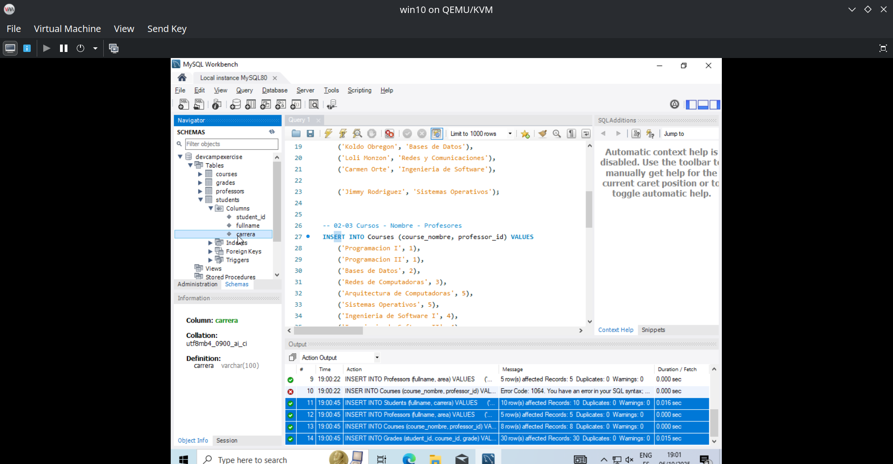
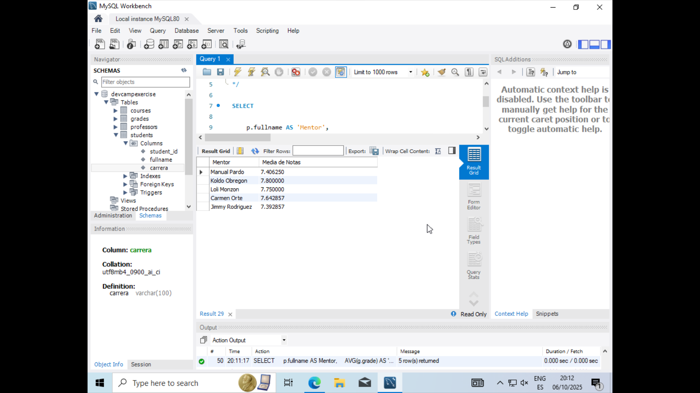
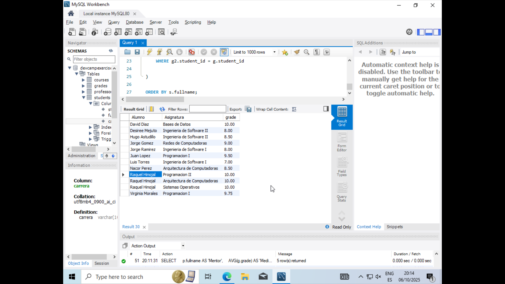
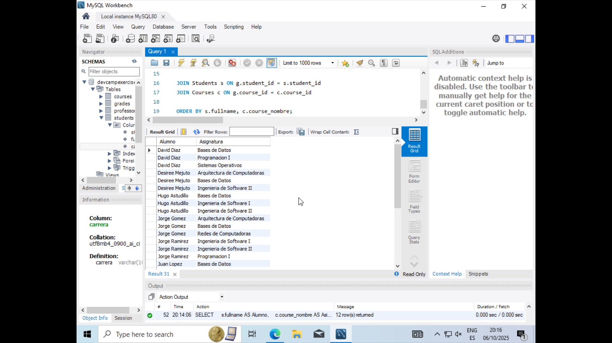
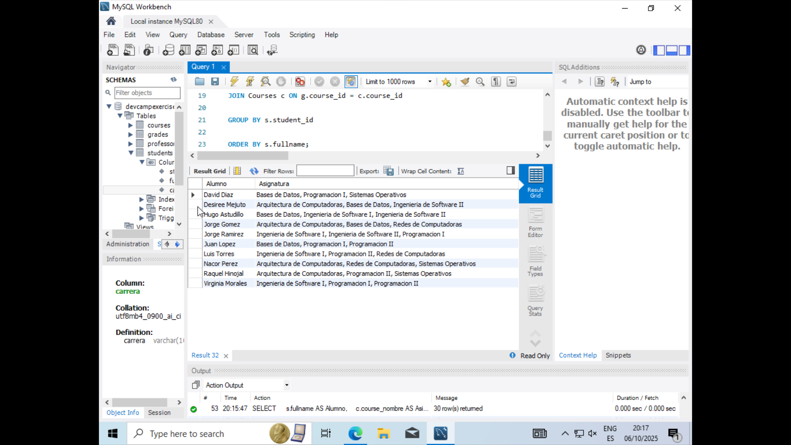
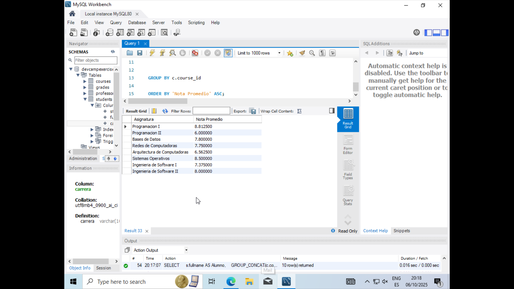
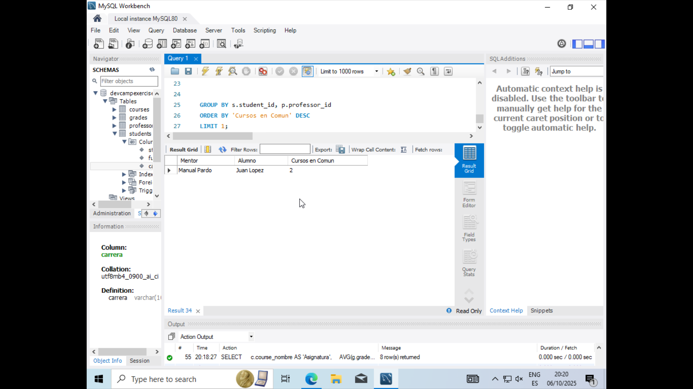
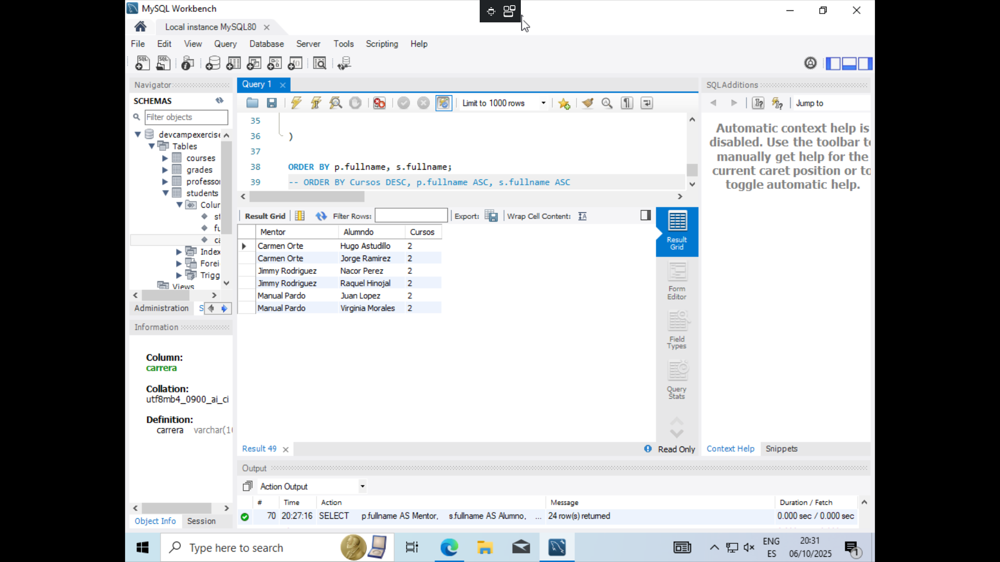

# Project Requirements for SQL Course

## Main Goal

    - Build a SQL database for a university that manages students, courses, professors, and grades.

## Requirements
The project needs to contain the following technical features:  

    1. Build a database with the following tables: `Students`, `Courses`, `Professors`, `Grades`
    
    2. Foreign Key relationships between the tables
    
    3. Create a script that populates all of the database tables with sample data
    
    4. SQL query scripts for:
    
        - 4.1   The average grade that is given by each professor
    
        - 4.2   The top grades for each student
    
        - 4.3   Sort students by the courses that they are enrolled in
    
        - 4.4   Create a summary report of courses and their average grades, sorted by the most challenging course (course with the lowest average grade) to the easiest course
    
        - 4.5   Finding which student and professor have the most courses in common

## Submission options
Push all scripts here.

---

## Environment

#### OS
Windows 10 x64 22H2 (Virtual Machine)

#### SQL
MySQL Community 8.0.43

#### IDE - SQL GUI 
MySQL-Workbench 8.0

---

## Scripts

### 01 - SCHEMA & TABLES
| File | Description |
|------|--------------|
| `01_00_CREATE_SCHEMA.sql` | Creates the `devcampexercise` DB (charset & collation explainations) |
| `01_01_CREATE-TABLES-Todas.sql` | Creates `Students`, `Professors`, `Courses`, and `Grades` tables with primary and foreign keys. |

---

### 02 - INSERT DATA
| File | Description |
|------|--------------|
| `02_01_INSERT_Data.sql` | Inserts sample data: 10 students, 5 professors, 8 courses, and ~30 grades. |

---

### 03 - SQL QUERIES

#### 03.01 – Averages
| File | Description |
|------|--------------|
| `03_01-AVG.sql` | Calculates the average grade given by each professor. |

---

#### 03.02 – Top Grades
| File | Description |
|------|--------------|
| `03_02-TOP.sql` | Shows the top grade achieved by each student. |

---

#### 03.03 – Sorting Students by Courses
| File | Description |
|------|--------------|
| `03_03_01_SORT_sin_agrupar.sql` | Lists students ordered by enrolled courses (not grouped). |

| File | Description |
|------|--------------|
| `03_03_02-SORT_agrupado_USANDO_GROUP-CONCAT.sql` | Displays students grouped by their courses using `GROUP_CONCAT`. |

---

#### 03.04 – Course Summary
| File | Description |
|------|--------------|
| `03_04-SUMMARY.sql` | Shows each course’s average grade, ordered from hardest (lowest average) to easiest. |

---

#### 03.05 – Common Courses (Professor–Student)
| File | Description |
|------|--------------|
| `03_05_01-COUNT_Professors-Students_commons-TODOS_basico.sql` | Finds the professor–student pair with the most courses in common (basic version). |

| File | Description |
|------|--------------|
| `03_05_02-COUNT_Professors-Students_commons_MAX-HAVING-SUBQUERY.sql` | Returns all pairs tied for the maximum using a `HAVING COUNT() = MAX(...)` subquery. |

---
